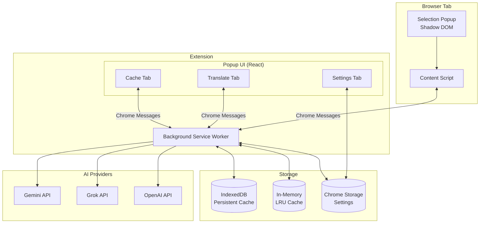
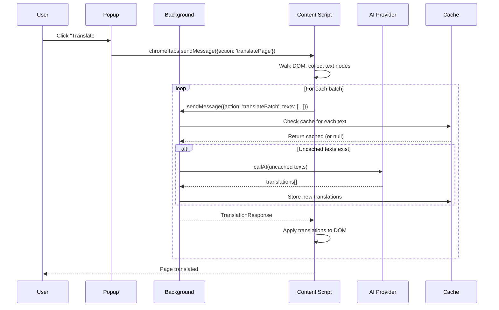
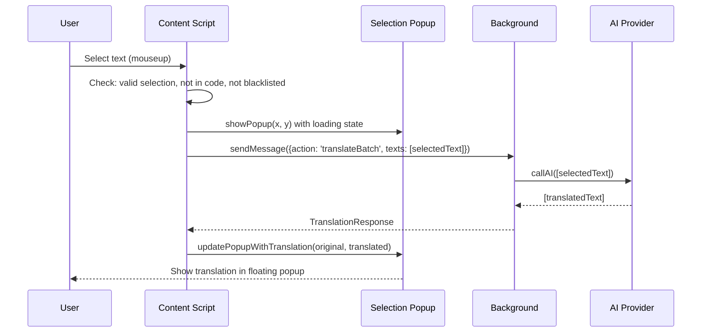
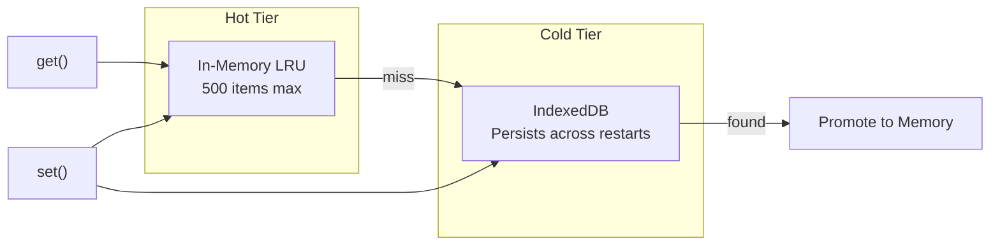

# Spyder-Scribe Architecture

Spyder-Scribe is a Chrome browser extension that provides advanced AI-powered translation using multiple LLM providers (Gemini, Grok, OpenAI) with JSON-structured prompts for reliability.

## Table of Contents

- [High-Level Architecture](#high-level-architecture)
- [Technology Stack](#technology-stack)
- [Directory Structure](#directory-structure)
- [Core Components](#core-components)
  - [Background Service Worker](#background-service-worker)
  - [Content Scripts](#content-scripts)
  - [Popup UI](#popup-ui)
  - [Shared Libraries](#shared-libraries)
- [Data Flow](#data-flow)
- [Translation Pipeline](#translation-pipeline)
- [Caching System](#caching-system)
- [Error Handling](#error-handling)
- [Testing](#testing)

---

## High-Level Architecture



---

## Technology Stack

| Category | Technology |
|----------|------------|
| **Runtime** | Chrome Extension (Manifest V3) |
| **Frontend** | React 19, TypeScript |
| **Build** | Vite 7 with [@crxjs/vite-plugin](https://crxjs.dev/vite-plugin) |
| **Styling** | Tailwind CSS 4 |
| **UI Components** | shadcn/ui (Radix primitives) |
| **Testing** | Vitest, @testing-library/react |
| **Package Manager** | pnpm |

---

## Directory Structure

```
src/
├── background/              # Service worker (runs in extension context)
│   ├── index.ts            # Entry point, message listener, context menu setup
│   ├── handlers/
│   │   └── messages.ts     # Message routing and batch processing
│   ├── managers/
│   │   └── contextMenu.ts  # Right-click context menu & site blacklisting
│   └── services/
│       ├── cache.ts        # Hybrid in-memory + IndexedDB cache
│       ├── translation.ts  # Translation orchestrator (routes to providers)
│       └── providers/
│           ├── gemini.ts   # Google Gemini API implementation
│           ├── grok.ts     # xAI Grok API implementation
│           └── openai.ts   # OpenAI API implementation
│
├── content/                 # Injected into every web page
│   ├── index.ts            # Entry point, translation engine, event handlers
│   └── selection/
│       ├── blacklist.ts    # Site blacklist checking
│       ├── selectionService.ts  # Text selection utilities
│       └── SelectionPopup.ts    # Shadow DOM popup for selection translation
│
├── popup/                   # Extension popup (React app)
│   ├── index.html          # Popup HTML entry
│   ├── index.tsx           # React entry point
│   ├── Popup.tsx           # Main popup component with tabs
│   └── components/
│       ├── TranslateTab.tsx    # Full-page translation controls
│       ├── SettingsTab.tsx     # API keys, model selection, preferences
│       └── CacheTab.tsx        # Cache debugging and management
│
├── components/
│   └── ui/                  # shadcn/ui components (Button, Select, Tabs, etc.)
│
├── lib/
│   ├── errors.ts           # Centralized error handling with typed errors
│   └── utils.ts            # General utilities (cn for className merging)
│
├── __tests__/              # Test files mirroring src structure
│   ├── setup.ts            # Test setup (mocks, IndexedDB, etc.)
│   ├── pretty-reporter.ts  # Custom Vitest reporter
│   ├── background/         # Background script tests
│   ├── content/            # Content script tests
│   ├── lib/                # Utility tests
│   └── popup/              # Popup component tests
│
├── manifest.json           # Chrome extension manifest (MV3)
├── globals.css             # Global styles and Tailwind imports
└── index.css               # Additional root styles
```

---

## Core Components

### Background Service Worker

**Location:** `src/background/`

The background service worker is the extension's central hub. It:

1. **Listens for Messages** from content scripts and popup
2. **Routes Translation Requests** through the translation service
3. **Manages the Hybrid Cache** (memory + IndexedDB)
4. **Sets Up Context Menus** for right-click translation and site blacklisting

**Key Files:**

| File | Purpose |
|------|---------|
| `index.ts` | Entry point; sets up message listener and context menu |
| `handlers/messages.ts` | Routes messages by action type, handles batch processing |
| `managers/contextMenu.ts` | Creates context menu items, handles blacklist toggle |
| `services/translation.ts` | Orchestrates API calls based on selected model |
| `services/cache.ts` | Hybrid LRU + IndexedDB cache with TTL |
| `services/providers/*.ts` | Provider-specific API implementations |

**Message Types:**

```typescript
type MessageRequest = 
  | { action: 'translateBatch'; texts: string[]; source: string; target: string }
  | { action: 'getCacheStats' }
  | { action: 'getCacheEntries'; page?: number; limit?: number }
  | { action: 'clearCache' };
```

---

### Content Scripts

**Location:** `src/content/`

Injected into every web page, the content script handles:

1. **Full-Page Translation** – Walks the DOM, extracts text nodes, batches them, and applies translations
2. **Selection Translation** – Shows a popup when text is selected
3. **Visual Overlays** – Loading/error overlays during translation

**Key Components:**

| Component | Purpose |
|-----------|---------|
| `index.ts` | Main translation engine with DOM walking and batch logic |
| `selection/selectionService.ts` | Pure utilities for text selection handling |
| `selection/SelectionPopup.ts` | Shadow DOM popup for inline translation results |
| `selection/blacklist.ts` | Checks if current site is blacklisted |

**Translation Modes:**

1. **Full Page** – Triggered from popup; uses TreeWalker to find text nodes
2. **Selection Popup** – Shows on text selection with translated result
3. **Context Menu** – Right-click "Translate Selection" fallback

---

### Popup UI

**Location:** `src/popup/`

A React application rendered in the extension popup with three tabs:

| Tab | Component | Purpose |
|-----|-----------|---------|
| **Translate** | `TranslateTab.tsx` | Source/target language selectors, translate/revert buttons |
| **Settings** | `SettingsTab.tsx` | API keys (Gemini, Grok, OpenAI), model selection, custom prompts |
| **Cache** | `CacheTab.tsx` | View cache stats, browse entries, clear cache |

**UI Stack:**
- shadcn/ui components (Button, Select, Tabs, Input, etc.)
- Tailwind CSS for styling
- `sonner` for toast notifications
- Dark theme with gradient accents

---

### Shared Libraries

**Location:** `src/lib/`

| File | Purpose |
|------|---------|
| `errors.ts` | Typed error codes, `TranslationError` class, user-friendly messages |
| `utils.ts` | `cn()` utility for className merging (clsx + tailwind-merge) |

---

## Data Flow

### Full-Page Translation Flow



### Selection Translation Flow



---

## Translation Pipeline

### Provider Selection

```typescript
// Located in services/translation.ts
function callAI(textArray, source, target, model, gemKey, grokKey, openaiKey) {
    if (model.startsWith('grok'))   → fetchGrok(...)
    if (model.startsWith('gpt'))    → fetchOpenAI(...)
    else                            → fetchGemini(...)
}
```

### Prompt Strategy

All providers use the same JSON-structured prompt:

```
System: You are a translation engine. 
Input: A JSON array of strings.
Task: Translate each string from {source} to {target}.
Output: A strictly valid JSON array of strings. 
Rules: 
1. Maintain the exact order. 
2. No markdown, no code blocks.
3. Just the raw JSON array.

User: ["Hello", "World"]
```

### Provider-Specific Notes

| Provider | Endpoint | Special Handling |
|----------|----------|------------------|
| **Gemini** | `generativelanguage.googleapis.com` | Uses `responseMimeType: 'application/json'` |
| **Grok** | `api.x.ai` | Cleans markdown code blocks from response |
| **OpenAI** | `api.openai.com` | Chunks batches to 20 items max; uses `reasoning_effort: 'low'` |

---

## Caching System

**Location:** `src/background/services/cache.ts`

The cache uses a **hybrid architecture** for performance and persistence:



### Cache Entry Structure

```typescript
interface CacheEntry {
    key: string;        // source:target:text
    source: string;     // Source language
    target: string;     // Target language
    originalText: string;
    translation: string;
    createdAt: number;  // TTL: 7 days
}
```

### Cache Operations

| Method | Description |
|--------|-------------|
| `get(source, target, text)` | Check memory first, then IndexedDB; promotes on hit |
| `set(source, target, text, translation)` | Stores in both memory and IndexedDB |
| `clear()` | Clears both memory and IndexedDB |
| `getStats()` | Returns counts for memory, DB, and total |
| `getEntries(page, limit)` | Paginated retrieval for debug UI |
| `cleanExpired()` | Removes entries older than 7 days from IndexedDB |

---

## Error Handling

**Location:** `src/lib/errors.ts`

Centralized error handling with typed error codes:

### Error Codes

| Category | Codes |
|----------|-------|
| **API Keys** | `GEMINI_API_KEY_MISSING`, `GROK_API_KEY_MISSING`, `OPENAI_API_KEY_MISSING` |
| **Network** | `NETWORK_ERROR`, `TIMEOUT_ERROR` |
| **API Response** | `API_ERROR`, `RATE_LIMITED`, `INVALID_API_KEY`, `QUOTA_EXCEEDED` |
| **Parse** | `JSON_PARSE_ERROR`, `RESPONSE_MISMATCH`, `INVALID_RESPONSE` |
| **Extension** | `NO_ACTIVE_TAB`, `CONTENT_SCRIPT_NOT_LOADED`, `STORAGE_ERROR`, `MESSAGE_ERROR` |

### TranslationError Class

```typescript
class TranslationError extends Error {
    readonly code: ErrorCode;
    readonly userMessage: string;  // User-friendly message from lookup table
    readonly originalError?: unknown;
}
```

### Utility Functions

| Function | Purpose |
|----------|---------|
| `getUserFriendlyMessage(error)` | Converts any error to user-readable string |
| `getErrorCodeFromStatus(status)` | Maps HTTP status codes to error codes |
| `safeJsonParse(text, fallback?)` | Safe JSON parsing with optional fallback |
| `checkChromeError()` | Checks `chrome.runtime.lastError` |

---

## Testing

**Location:** `src/__tests__/`  
**Framework:** Vitest with @testing-library/react

### Test Structure

```
__tests__/
├── setup.ts                # Global mocks (chrome API, IndexedDB, etc.)
├── pretty-reporter.ts      # Custom test output formatting
├── background/
│   ├── handlers/           # Message handler tests
│   ├── managers/           # Context menu tests
│   └── services/           # Cache, translation, provider tests
├── content/
│   └── selection/          # Selection service tests
├── lib/
│   ├── errors.test.ts      # Error utility tests
│   └── utils.test.ts       # General utility tests
└── popup/
    ├── Popup.test.tsx      # Main popup tests
    └── components/         # Tab component tests
```

### Running Tests

```bash
# Run all tests
pnpm test

# Watch mode
pnpm test:watch

# With coverage
pnpm test:coverage
```

### Key Mocks

- **Chrome API**: Storage, tabs, runtime, contextMenus
- **IndexedDB**: Using `fake-indexeddb` for persistent cache tests
- **Fetch**: Mocked for provider API tests

---

## Build & Development

### Development

```bash
pnpm install
pnpm dev        # Starts Vite dev server with HMR
```

Load the extension:
1. Open `chrome://extensions`
2. Enable "Developer mode"
3. Click "Load unpacked" → Select `dist` folder

### Production Build

```bash
pnpm build      # TypeScript compilation + Vite build
```

### Key Configuration Files

| File | Purpose |
|------|---------|
| `manifest.json` | Extension manifest (MV3) with permissions and entry points |
| `vite.config.ts` | Vite configuration with crxjs plugin |
| `vitest.config.ts` | Test configuration |
| `tsconfig.*.json` | TypeScript configurations (app, node) |
| `components.json` | shadcn/ui configuration |

---

## Extension Permissions

| Permission | Purpose |
|------------|---------|
| `storage` | Save API keys and settings |
| `activeTab` | Access current tab for translation |
| `scripting` | Inject content scripts |
| `tabs` | Tab manipulation for context menu |
| `contextMenus` | Right-click menu items |

### Host Permissions

| Host | Purpose |
|------|---------|
| `generativelanguage.googleapis.com` | Gemini API |
| `api.x.ai` | Grok API |
| `api.openai.com` | OpenAI API |
